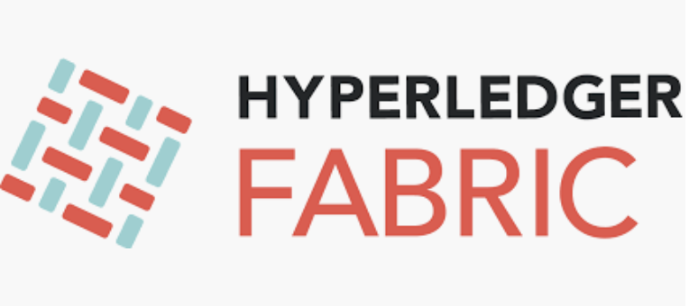

# Repo URL: [https://bit.ly/2FjuQ1d](https://bit.ly/2FjuQ1d)

This repo consists of a number of IBM code patterns focused on Hyperledger Fabric and IBM Blockchain.

They are being used for two-hour coding events using a chart deck provided outside of this repo.

Before the start of the coding event, the participants are encouraged to install the pre-requisites that are listed at the beginning of each exercise. Please note that MacBook and Ubuntu are the easiest operating systems to use.

For a 2-hour workshop the second, third and fourth exercises should be focused on. While the fifth, six and seventh can also be used for longer workshops. 

# [Introduction and Overview](intro.md)

# [Documentation](documentation.md)

# Development tool: 

[Visual Studio Code with the IBM Blockchain Platform Addition](https://code.visualstudio.com) and the [IBM Blockchain Extension for Hyperledger Fabrc developers ](https://marketplace.visualstudio.com/items?itemName=IBMBlockchain.ibm-blockchain-platform) 

# Exercises

1. SKIP [Building your first network](https://hyperledger-fabric.readthedocs.io/en/release-1.2/build_network.html)

2. [Write your first application: Fabcar](https://hyperledger-fabric.readthedocs.io/en/release-1.2/write_first_app.html)

3. [Create a global finance blockchain application with IBM Blockchain Platform Extension for VS Code](https://github.com/IBM/global-financing-blockchain)

## Hyperledger Fabric applications with IPV20 in the IBM Cloud

4. [Hyperledger Fabric sample Fabcar on IBM Blockchain Platform 2.0](https://github.com/IBM/fabcar-blockchain-sample)

#Strech Goals:

5. [Creating a basic Blockchain network using the IBM Blockchain Platform V2.0](https://github.com/IBM/Create-BlockchainNetwork-IBPV20)

6. [Emit events from Blockchain Platform V2.0](https://github.com/IBM/auction-events)

7. [Create a decentralized energy network with IBM Blockchain Platform 2.0](https://developer.ibm.com/patterns/decentralized-energy-with-hyperledger-fabric-and-ibm-blockchain-saasv2-use-case-1/)

# Where do we go from here?

[Blockchain Code Patterns](https://developer.ibm.com/patterns/category/blockchain/)

# Note on Whitelisting
https://console.bluemix.net/registration/whitelist
